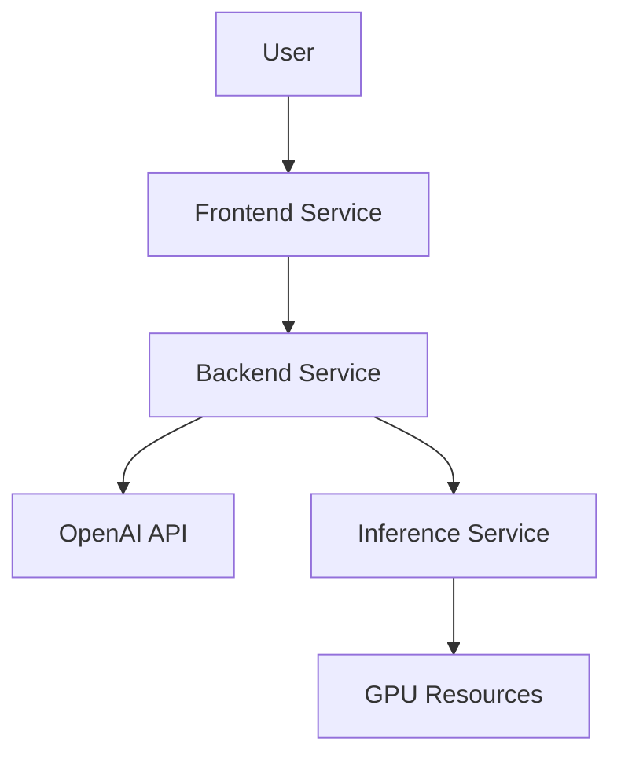

We walk through building a modern AI chat application that supports both OpenAI and local LLM models, with Kubernetes deployment and GPU acceleration.

## Table of Contents

1. [Project Overview](#project-overview)
2. [Architecture](#architecture)
3. [Development Setup](#development-setup)
4. [Kubernetes Deployment](#kubernetes-deployment)
5. [CI/CD Pipeline](#cicd-pipeline)
6. [Best Practices](#best-practices)

## Project Overview

Our AI chat application is a full-stack solution that demonstrates modern software development practices:

- **Multiple LLM Support**: Integration with OpenAI's GPT models and local models using vLLM
- **Microservices Architecture**: Separate services for frontend, backend, and inference
- **Container Orchestration**: Kubernetes deployment with GPU support
- **CI/CD Pipeline**: Automated testing and deployment using GitHub Actions

## Architecture

### Components

1. **Frontend (Streamlit)**
   - Modern chat interface
   - Real-time response streaming
   - Model selection and configuration

2. **Backend (FastAPI)**
   - API gateway
   - Request routing
   - Model management

3. **Inference Service (vLLM)**
   - GPU-accelerated inference
   - Model loading and caching
   - Efficient resource utilization

### Infrastructure



## Development Setup

### Prerequisites

- Python 3.10+
- Docker
- Kubernetes cluster
- NVIDIA GPU with drivers

### Local Development

1. **Clone the Repository**
   ```bash
   git clone https://github.com/yourusername/ai-chat.git
   cd ai-chat
   ```

2. **Set Up Environment**
   ```bash
   python -m venv venv
   source venv/bin/activate
   pip install -r requirements.txt
   ```

3. **Run Services**
   ```bash
   # Terminal 1 - Backend
   cd backend && uvicorn main:app --reload
   
   # Terminal 2 - Frontend
   cd frontend && streamlit run app.py
   
   # Terminal 3 - Inference
   cd inference && uvicorn main:app --reload
   ```

## Kubernetes Deployment

### Cluster Setup

1. **Enable GPU Support**
   ```bash
   # Install NVIDIA device plugin
   kubectl create -f https://raw.githubusercontent.com/NVIDIA/k8s-device-plugin/master/nvidia-device-plugin.yml
   ```

2. **Create Namespace**
   ```bash
   kubectl create namespace ai-chat
   ```

3. **Apply Configurations**
   ```bash
   kubectl apply -f k8s/configmap.yaml
   kubectl apply -f k8s/pvc.yaml
   kubectl apply -f k8s/backend-deployment.yaml
   kubectl apply -f k8s/frontend-deployment.yaml
   kubectl apply -f k8s/inference-deployment.yaml
   ```

### Resource Management

- GPU allocation through Kubernetes device plugins
- Persistent volume for model storage
- Resource limits and requests for each service

## CI/CD Pipeline

### GitHub Actions Workflow

1. **Build and Test**
   - Run unit tests
   - Build Docker images
   - Push to container registry

2. **Deploy**
   - Update Kubernetes manifests
   - Apply configurations
   - Verify deployment

### Security Considerations

- Secrets management
- Image scanning
- Access control

## Best Practices

### Development

1. **Code Organization**
   - Modular architecture
   - Clear separation of concerns
   - Comprehensive testing

2. **Performance**
   - Efficient resource utilization
   - Caching strategies
   - Load balancing

3. **Security**
   - API key management
   - Input validation
   - Error handling

### Deployment

1. **Monitoring**
   - Health checks
   - Resource usage
   - Error tracking

2. **Scaling**
   - Horizontal pod autoscaling
   - Resource optimization
   - Load distribution

3. **Maintenance**
   - Regular updates
   - Backup strategies
   - Disaster recovery

## Conclusion

This project demonstrates how to build and deploy a modern AI application using best practices in software development and DevOps. The combination of microservices architecture, container orchestration, and GPU acceleration provides a scalable and efficient solution for AI-powered applications.

## Resources

- [vLLM Documentation](https://github.com/vllm-project/vllm)
- [FastAPI Documentation](https://fastapi.tiangolo.com/)
- [Kubernetes Documentation](https://kubernetes.io/docs/)
- [GitHub Actions Documentation](https://docs.github.com/en/actions)